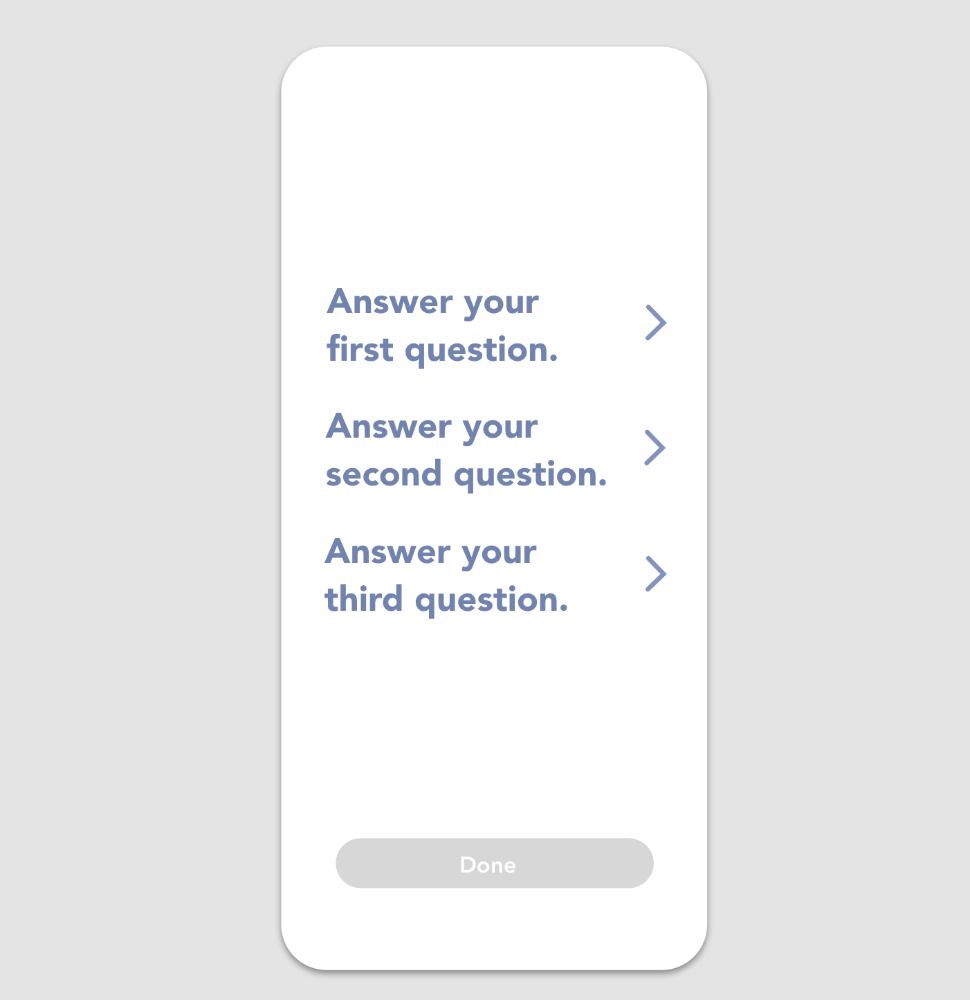

# Frontend-expo-app

## Install

```shell
git clone https://github.com/xj-m/my-app
cd my-app
npm install --global expo-cli
npm install
expo start
# then the instructions would show up in your terminal:
#  To run the app with live reloading, choose one of:
#  › Scan the QR code above with the Expo app (Android) or the Camera app (iOS).
#  › Press a for Android emulator, or i for iOS simulator, or w to run on web.
#  › Press e to send a link to your phone with email.
```

I recommend to download "Expo app" then scan the QR code using your phone

If there's any problem, please refer to <https://docs.expo.io/get-started/installation/>

## Tasks

- You only need to change the code in "App.js" to finish all the tasks.
- There are three screens inside `App.js`, `QaScreen`,`CounterScreen` and `TagScreen`, currently after you launch simulator, three screens should be like this (you can switch screens by clicking the bottom tab icons)


### Task1: QaScreen

In `QaScreen()`, add missing components and adjust styles to make it looks like the following image



### Task2: CounterScreen

create a counter using react hook (<https://reactjs.org/docs/hooks-state.html>)
This means every time you click "click me", the text number above it will increase by 1

### Task3: TagScreen

This screen is supposed to enable the user to choose or add their tags, which means

1. After the user clicking "#Add New," a new tag box will show up
2. The user can select or deselect any tag box, and the target tag box's style will change accordingly.

You don't have to change the code in `TagScreen().` You can write down your idea of implementing the required features.
